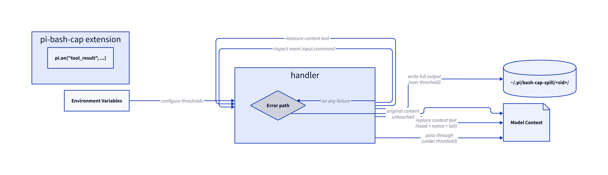

# Plan: Implement pi-bash-cap pi extension for mechanical Bash output capping

**ID:** plan-001-james-dixson-663cb7
**Author:** james-dixson
**Created:** 2026-09-26
**Status:** approved
**Deliverable-class:** standard
**Fingerprint:** 49b88ae813351c888bddafbc85dec70ed6f71e97c817c44f2e3efe4731af033a

## Objective
Implement a pi coding-agent extension that mechanically caps oversized Bash tool output before it enters the model context window. The model sees a truncated view (head + cap notice + tail); full output spills to a recoverable file. This is the pi equivalent of the claude-code PostToolUse hook `bash-output-cap.sh` (dixson3/rc-files).

## Motivation
Pi's Bash tool output is truncated to 2000 lines / 50KB at the output-collection layer, but this limit is a hard drop — the model gets the first 2000 lines and nothing else, with no way to recover what was dropped. The model cannot distinguish "output was truncated by the cap" from "that was the actual output," and it has no path to the missing content.

The `bash-output-cap.sh` hook for claude-code solves this by operating at the PostToolUse layer — after output is collected but before it enters context — spilling the full output to a recoverable file and replacing the model-facing content with head + cap notice + tail. The model knows it is seeing a truncated view, can grep the spill file, and can re-run uncapped when completeness is the point.

This extension provides the same capability for pi users, using pi's ExtensionAPI `tool_result` event handler, which is the pi equivalent of the claude-code PostToolUse hook.

## Upstream Issues
| Issue | Title | Disposition | Notes | Resolved By |
|-------|-------|-------------|-------|-------------|

no-upstream-issues: triage ran 2026-09-26 via `gh issue list --search "bash cap" --limit 20` — zero matches

## Investigation Findings
Reference implementations already exist for both the target pattern and the cap logic — no investigation needed:

- **pi extension pattern:** `context-mode` extension at `~/.pi/agent/npm/node_modules/context-mode/build/adapters/pi/extension.js` demonstrates `pi.on("tool_result", ...)` handler registration, `BashToolResultEvent` type shape (`event.toolName === "bash"`, `event.input.command`, `event.content: (TextContent | ImageContent)[]`, `event.details: BashToolDetails`), and the `ToolResultEventResult` return type (`{ content?: (TextContent | ImageContent)[], details?: unknown }`).
- **Cap logic:** `bash-output-cap.sh` at `~/_dotfiles/rc-files/claude/hooks/bash-output-cap.sh` provides the complete spill-and-cap algorithm: threshold checks (lines/bytes), spill file path derivation, head+notice+tail assembly, stderr bounding, and the `nocap` escape hatch.
- **pi extension types:** `core/extensions/types.d.ts` confirms `ToolResultEventResult` with `content`, `details`, `isError`, and `usage` fields. `BashToolDetails` has `truncation?: TruncationResult` and `fullOutputPath?: string`.
- **Packaging:** `docs/packages.md` documents the `pi` field in `package.json`, conventional directories (`extensions/`), and the `pi-package` keyword for pi.dev/packages discovery.

## Approach
Single-file TypeScript extension (`index.ts`) with no npm dependencies beyond what the pi runtime provides. Register a `tool_result` event handler that:

1. Guards on `event.toolName === "bash"` (and `"powershell"` for completeness). The handler narrows `event` to `BashToolResultEvent | PowerShellToolResultEvent` before accessing `event.input.command`, since `ToolResultEventBase.input` is typed `Record<string, unknown>`.
2. Skips on: `PI_BASH_CAP_OFF=1`, `nocap` in command, `event.isError`, image content present, empty content
3. Detects pi's built-in truncation: if `event.details?.fullOutputPath` exists and points to a readable file, reads it for true total lines/bytes (pi pre-truncates to 2000/50KB before the handler fires — the extension must measure against the real total, not the already-truncated content). If `event.details?.truncation` is present, uses `truncation.totalLines`/`truncation.totalBytes` without reading the file.
4. Concatenates all `content[].text` blocks; measures lines and bytes. When `fullOutputPath` is available, uses those dimensions; otherwise measures from content directly.
5. If below both thresholds → pass through (return `undefined`)
6. If over threshold → spill full text to `~/.pi/bash-cap-spill/<toolCallId>.txt` (toolCallId is unique per execution, naturally shards concurrent calls without session-ID plumbing), build replacement content array with head + cap notice + tail, return `{ content: [{ type: "text", text: cappedText }] }`
7. When pi's built-in truncation spilled the full output to `fullOutputPath`, the extension uses that file directly rather than re-spilling from `event.content` (which is already truncated)
8. Bound stderr similarly (keep it visible but capped)
9. Any error → return `undefined` (fail-open, original result preserved)

Reuse the same environment variable naming from the claude-code hook, prefixed `PI_` instead of `CLAUDE_`:
- `PI_BASH_CAP_LINES` (default 400)
- `PI_BASH_CAP_BYTES` (default 20000)
- `PI_BASH_CAP_HEAD` (default 100)
- `PI_BASH_CAP_TAIL` (default 40)
- `PI_BASH_CAP_OFF` (default unset)

The cap notice mimics the bash-output-cap.sh format: a separator block with line/byte counts, the spill path, recovery commands, and the uncap re-run instruction.

## Epics
### Epic 1: Extension implementation
- Issue 1.1: Create `index.ts` — single-file pi extension with `tool_result` handler for bash output capping
- Issue 1.2: Package the extension for npm/pi.dev — `package.json` with `pi` field, MIT license, `pi-package` keyword, SKILL.md

## Gates
### Start Gate (mandatory)
- Type: human
- Approvers: operator

### Reconcile Gate
- Type: auto (all execution beads closed)
- Blocks: reconcile step

## Risks & Mitigations
| # | Risk | Severity | Mitigation |
| :-- | :-- | :-- | :-- |
| R1 | Cap alters output the model genuinely needs in full (e.g., a failing test's complete error) | med | Model can grep the spill file or re-run with `# nocap`; the cap notice is explicit about what was dropped and how to recover |
| R2 | Extension loaded but env vars not set — unexpected default behavior | low | Sensible defaults documented in SKILL.md; `PI_BASH_CAP_OFF=1` provides a global kill switch |
| R3 | PowerShell output uses different type shape than Bash | low | Guard on both `"bash"` and `"powershell"`; both share `BashToolDetails` and content structure |

## Success Criteria
| # | Criterion | Verification | Discharged-by |
| :-- | :-- | :-- | :-- |
| SC1 | Extension loads without errors via `pi --extension ./index.ts` | manual: pi registers extension and starts normally | 1.1 |
| SC2 | Bash output below thresholds passes through unchanged | manual: `echo "short output"` returns verbatim in model context | 1.1 |
| SC3 | Bash output above thresholds is capped: model sees head+notice+tail, full output spilled to file | manual: `yes "x" | head -1000` triggers cap; verify spill file exists with all 1000 lines | 1.1 |
| SC4 | `nocap` anywhere in the command bypasses capping | manual: `yes "x" | head -1000 # nocap` returns full output | 1.1 |
| SC5 | `PI_BASH_CAP_OFF=1` disables the extension entirely | manual: set env var, oversized output passes through uncapped | 1.1 |
| SC6 | Extension errors (e.g., disk full) leave original result untouched | manual: fail-open — any thrown error in handler returns `undefined` | 1.1 |
| SC7 | PowerShell output is also capped (same underlying type) | manual: oversized PowerShell output triggers cap | 1.1 |
| SC8 | Package is publishable to npm with correct pi metadata and MIT license | manual: `package.json` includes `pi` field, `pi-package` keyword, MIT license, attribution to James Dixson (dixson3) | 1.2 |
| SC9 | SKILL.md documents installation, configuration, and usage | manual: SKILL.md present at package root covering env vars, nocap escape hatch, recovery commands | 1.2 |
